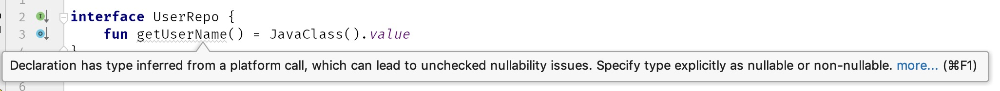

The null-safety introduced by Kotlin is amazing. Java was known in the community from Null-Pointer Exceptions (NPE), and Kotlin’s safety mechanisms make them rare or eliminate them entirely. Although one thing that cannot be secured completely is a connection between a language that does not have solid null-safety - like Java or C - and Kotlin. Imagine that we use a Java method that declares String as a return type. What type should it be in Kotlin?

Kotlin引入的空安全令人惊喜。Java因空指针异常(NPE)而在社区中为人所知，Kotlin的安全机制使得这种异常很少出现，或者完全消除。但还有一些例外，那就是kotlin 与 java或c的互调时。假设我们使用一个Java方法声明String为返回类型。在Kotlin应该是什么类型?

If it is annotated with the @Nullable annotation then we assume that it is nullable and we interpret it as a String?. If it is annotated with @NotNull then we trust this annotation and we type it as String. Though, what if this return type is not annotated with either of those annotations?

如果它被@Nullable注释，那么我们假设它是空的，并将其解释为一个字符串?如果它被@NotNull注释，那么我们相信这个注释，并将其输入为String。但是，如果这个返回类型没有使用这些注释中的任何一个进行注释呢?

```java
// Java 
public class JavaTest {
    public String giveName() { 
      	// ...
    }
}
```

We might say that then we should treat such a type as nullable. This would be a safe approach since in Java everything is nullable. However, we often know that something is not null so we would end up using the not-null assertion !! in many places all around our code.

我们可以说，应该将这样的类型视为空的。这将是一个安全的方法，因为在Java中一切都是空的。然而，我们通常知道有些东西不是空的，所以我们最终会使用非空断言!!在我们代码的很多地方。

The real problem would be when we would need to take generic types from Java. Imagine that a Java API returns a List<User> that is not annotated at all. If Kotlin would assume nullable types by default, and we would know that this list and those users are not null, we would need to not only assert the whole list but also filter nulls:

真正的问题是什么时候我们需要从Java中获取泛型类型。假设一个Java API返回一个List<User>，它没有任何注释。如果Kotlin默认假设为空类型，并且我们知道这个列表和那些用户不是空的，那么我们不仅需要断言整个列表，还需要过滤空值:

```java
// Java 
public class UserRepo {
		public List<User> getUsers() { 
      	//*** 
    }
}

// Kotlin 
val users: List<User> = UserRepo().users!!.filterNotNull()
```

What if a function would return a List<List<User>> instead?
如果函数返回List<List<User>>呢?
Gets complicated:
变得复杂了

```kotlin
val users: List<List<User>> = UserRepo().groupedUsers!!.map { it!!.filterNotNull() }
```

Lists at least have functions like map and filterNotNull. In other generic types, nullability would be an even bigger problem. This is why instead of being treated as nullable by default, a type that comes from Java and has unknown nullability is a special type in Kotlin. It is called a platform type.

集合至少有map和filterNotNull这样的函数。在其他泛型类型，可空性将是一个更大的问题。这就是为什么一种来自Java且未知可为空的类型在Kotlin中是一种特殊类型，而不是默认情况下被视为可为空。它被称为平台类型。

Platform type - a type that comes from another language and has unknown nullability.、

平台类型——一种来自另一种语言的类型，并且具有未知的可空性。

Platform types are notated with a single exclamation mark ! after the type name, such as String!. Though this notation cannot be used in a code. Platform types are non-denotable, meaning that one cannot write them down explicitly in the language. When a platform value is assigned to a Kotlin variable or property, it can be inferred but it cannot be explicitly set. Instead, we can choose the type that we expect: Either a nullable or a non-null type.

平台类型用一个感叹号表示!在类型名之后，例如String!虽然这种表示法不能在代码中使用。平台类型是不可表示的，这意味着不能在语言中显式地将它们写下来。当将平台值赋给Kotlin变量或属性时，可以推断它，但不能显式地设置它。相反，我们可以选择预期的类型:可空或非空类型。

```kotlin
// Java 
public class UserRepo {
    public User getUser() {
    		//...
    } 
}

// Kotlin 
val repo = UserRepo() 
val user1 = repo.user // Type of user1 is User! 
val user2: User = repo.user // Type of user2 is User 
val user3: User? = repo.user // Type of user3 is User?
```

Thanks to this fact, getting generic types from Java is not problematic:
由于这个事实，从Java获得泛型类型是没有问题的:

```kotlin
val users: List<User> = UserRepo().users 
val users: List<List<User>> = UserRepo().groupedUsers
```

The problem is that is still dangerous because something we assumed to be not-null might be null. This is why for safety reasons I always suggest to be very conscientious of when we get platform types from Java. Remember that even if a function does not return null now, that doesn’t mean that it won’t change in the future. If its designer hasn’t specified it by an annotation or by describing it in a comment, they can introduce this behavior without changing any contract.

问题是，这仍然是危险的，因为我们认为非空的东西可能是空的。这就是为什么出于安全原因，我总是建议从Java获取平台类型时要非常谨慎。记住，即使一个函数现在不返回null，这并不意味着它将来不会改变。如果设计器没有通过注释或在注释中描述它，他们可以引入这种行为而不改变任何契约。

If you have some control over Java code that needs to interoperate with Kotlin, introduce @Nullable and @NotNull annotations wherever possible.

如果您对需要与Kotlin互操作的Java代码有一定的控制，请尽可能引入@Nullable和@NotNull注释。

```java
// Java 
import org.jetbrains.annotations.NotNull; 
public class UserRepo {
		public @NotNull User getUser() {
				//...
    } 
}
```

This is one of the most important steps when we want to support Kotlin developers well (and it’s also important information for Java developers). Annotating many exposed types was one of the most important changes that were introduced into the Android API after Kotlin became a first-class citizen. This made the Android API much more Kotlin-friendly.

当我们想要更好地支持Kotlin开发人员时，这是最重要的步骤之一(对于Java开发人员来说，这也是重要的信息)。注解许多公开的类型是Kotlin成为一等公民后引入Android API的最重要的变化之一。这使得Android API对kotlin更加友好。

Note that many different kinds of annotations are supported, including those by:

请注意，它支持许多不同类型的注释，包括:

- JetBrains (@Nullable and @NotNull from org.jetbrains.annotations)

- Android (@Nullable and @NonNull from androidx.annotation as well as from com.android.annotations and from the support library android.support.annotations)

- JSR-305 (@Nullable,@CheckForNull and @Nonnull from javax.annotation)

- JavaX (@Nullable, @CheckForNull, @Nonnull from javax.annotation)

- FindBugs (@Nullable, @CheckForNull, @PossiblyNull and @NonNull from edu.umd.cs.findbugs.annotations)

- ReactiveX (@Nullable and @NonNull from io.reactivex.annotations)

- Eclipse (@Nullable and @NonNull from org.eclipse.jdt.annotation)

- Lombok (@NonNull from lombok)

Alternatively, you can specify in Java that all types should be Notnull by default using JSR 305’s @ParametersAreNonnullByDefault annotation.

或者，您可以在Java中使用JSR 305的@ParametersAreNonnullByDefault注释指定所有类型默认为Notnull。

There is something we can do in our Kotlin code as well. My recommendation for safety reasons is to eliminate these platform types as soon as possible. To understand why, think about the difference between how statedType and platformType functions behave in this example:

我们也可以在Kotlin代码中做一些事情。出于安全原因，我建议尽快删除这些平台类型。为了理解其中的原因，考虑一下这个例子中statedType和platformType函数行为的区别:

```kotlin
// Java 
public class JavaClass {
		public String getValue() {
				return null;
    } 
}

// Kotlin 
fun statedType() {

		val value: String = JavaClass().value

		//...

		println(value.length) 
}

fun platformType() { 
  	val value = JavaClass().value 
  	//...
  	println(value.length) 
}
```

In both cases, a developer assumed that getValue will not return null and he or she was wrong. This results in an NPE in both cases, but there’s a difference in where that error happens.
在这两种情况下，开发人员都假设getValue不会返回null，他或她错了。这在两种情况下都会导致NPE，但错误发生的位置有所不同。

In statedType the NPE will be thrown in the same line where we get the value from Java. It would be absolutely clear that we wrongly assumed a not-null type and we got null. We would just need to change it and adjust the rest of our code to this change.
在statedType中，NPE将被抛出在我们从Java获得值的同一行中。很明显，我们错误地假设了非空类型，结果是空的。我们只需要更改它，并根据此更改调整其余代码。

In platformType the NPE will be thrown when we use this value as not-nullable. Possibly from a middle of some more complex expression. Variable typed as a platform type can be treated both as nullable and not-nullable. Such variable might be used few times safely, and then unsafely and throw NPE then. When we use such properties, typing system do not protect us. It is a similar situation as in Java, but in Koltin we do not expect that we might have NPE just from using an object. It is very likely that sooner or later someone will use it unsafely, and then we will end up with a runtime exception and its cause might be not so easy to find.
在平台类型中，当我们将此值用作非空值时，将抛出NPE。可能是一些更复杂的表达式。平台类型的变量既可以被视为可空的，也可以被视为不可空的。这样的变量可能会安全地使用几次，然后不安全地抛出NPE。当我们使用这些属性时，打字系统并不能保护我们。这与Java中的情况类似，但在Koltin中，我们并不期望仅仅通过使用对象就可以获得NPE。很有可能迟早有人会不安全地使用它，然后我们将以运行时异常结束

```kotlin
// Java 
public class JavaClass {
		public String getValue() {
				return null;
    } 
}

// Kotlin 
fun platformType() {
		val value = JavaClass().value
		//...
		println(value.length) // NPE 
}

fun statedType() { 
  	val value: String = JavaClass().value // NPE 
  	//...
  	println(value.length) 
}
```

What is even more dangerous, platform type might be propagated further. For instance, we might expose a platform type as a part of our interface:
更危险的是，平台类型可能会被进一步传播。例如，我们可以将平台类型公开为接口的一部分:

```kotlin
interface UserRepo { 
    fun getUserName() = JavaClass().value 
}
```

In this case, methods inferred type is a platform type. This means that anyone can still decide if it is nullable or not. One might choose to treat it as nullable in a definition site, and as a non-nullable in the use-site:

在本例中，方法推断类型是平台类型。这意味着任何人都可以决定它是否为空。可以选择在定义站点中将其视为空值，而在use-site中将其视为非空值:

```kotlin
class RepoImpl: UserRepo {
   override fun getUserName(): String? {
       return null
   }
}

fun main() {
   val repo: UserRepo = RepoImpl()
   val text: String = repo.getUserName() // NPE in runtime
   print("User name length is ${text.length}")
}
```

Propagating a platform type is a recipe for disaster. They are problematic, and for safety reasons, we should always eliminate them as soon as possible. In this case, IDEA IntelliJ helps us with a warning:

传播平台类型会带来灾难。它们是有问题的，出于安全原因，我们应该总是尽快消除它们。在这种情况下，IDEA IntelliJ提供了一个警告:



#### Summary
#### 总结

Types that come from another language and has unknown nullability are known as platform types. Since they are dangerous, we should eliminate them as soon as possible, and do not let them propagate. It is also good to specify types using annotations that specify nullability on exposed Java constructors, methods and fields. It is precious information both for Java and Kotlin developers using those elements.

来自另一种语言且具有未知的可空性的类型称为平台类型。既然它们是危险的，我们应该尽快消灭它们，不让它们传播。使用注释指定类型也很好，注释可以在公开的Java构造函数、方法和字段上指定可空性。对于使用这些元素的Java和Kotlin开发人员来说，这都是宝贵的信息。