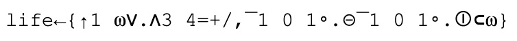

# Chapter 2: Readability
# 第二章:可读性

> *Any fool can write code that a computer can understand. Good programmers write code that humans can understand.*
> –Martin Fowler, *Refactoring: Improving the Design of Existing Code, p. 15*
> *任何傻瓜都能写出计算机能理解的代码。好的程序员写的代码人类都能理解*
> -Martin Fowler， *重构:改进现有代码的设计，第15页*

There is a very common misconception that Kotlin is designed to be concise. It isn’t. There are languages that are much more concise. For instance, the most concise language I know is APL. This is John Conway’s “Game of Life” implemented in APL:
有一个非常普遍的误解，认为Kotlin的设计是简洁的。它不是。有些语言更简洁。例如，我所知道的最简明的语言是APL。这是John Conway的“生命游戏”在APL中的应用:



Your first thought is probably “Wow, that’s short”. Then you might realize that you don’t have some of those characters on your keyboard. There are more such languages, for example, here is the same program in J:
：你的第一反应可能是“哇，这太短了”。然后你可能会意识到你的键盘上没有这些字符。还有更多这样的语言，例如，这里是同一个程序在J:


```
1 life=:[:+/(3 4=/[:+/(,/,"0/~i:1)|.])*.1,:]
```

These two are really concise languages. This characteristic makes them champions in code golf contests. It also makes them absurdly hard to read. Let’s be honest: even for experienced APL developers (and there are probably only a few of them in the world), it is a challenge to understand what this program does and how it works. 
这两种语言非常简洁。这一特点使他们成为代码高尔夫比赛的冠军。这也让它们难以读懂。坦率地说:即使是对有经验的APL开发人员(世界上可能只有少数人)来说，理解这个程序做什么以及它是如何工作的也是一个挑战。

Kotlin never had ambitions to be very concise. It is designed to be **readable**. It is concise compared to other popular languages, but this comes from the fact that Kotlin eliminates a lot of noise: boilerplate code and repetitive structures. It was done to help developers concentrate on what is important, and thus make Kotlin more readable. 
Kotlin从来没有想过要变得非常简洁。它被设计成**可读**。与其他流行语言相比，Kotlin更简洁，但这是因为Kotlin消除了很多干扰:样板代码和重复结构。这样做是为了帮助开发人员专注于重要的事情，从而使Kotlin更具可读性。

Kotlin allows programmers to design clean and meaningful code and APIs. Its features let us hide or highlight whatever we want. This chapter is about using these tools wisely. This particular chapter serves as an introduction and provides a set of general suggestions. Although it also introduces the concept of readability, which we will refer to in the rest of this book. Especially in *Part 2: Abstraction design*, where we will dive into topics related to class and function design.
Kotlin允许程序员设计干净而有意义的代码和api。它的功能可以让我们隐藏或突出任何我们想要的东西。本章是关于如何明智地使用这些工具。这一章作为一个导言，并提供了一套一般性的建议。虽然它也引入了可读性的概念，我们将在本书的其余部分提到。特别是在*第2部分:抽象设计*中，我们将深入讨论与类和函数设计相关的主题。

Let’s start with a bit more abstract item about readability, which will introduce the general problem.
让我们从更抽象的关于可读性的项目开始，这将引入一般的问题。
