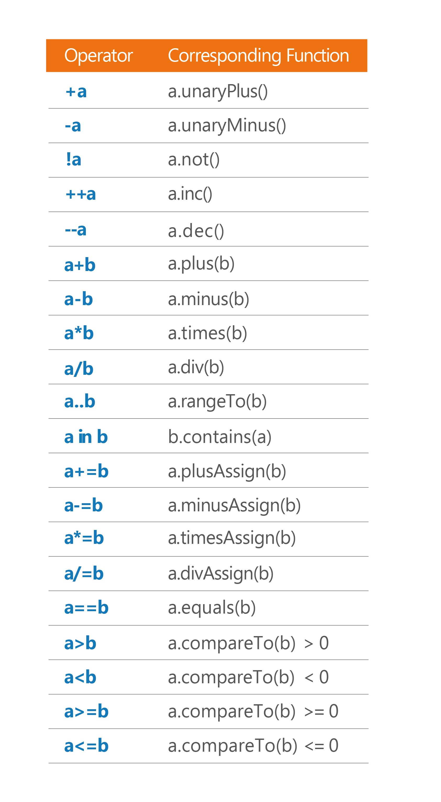

## Item 12: Operator meaning should be consistent with its function name
## 操作符的含义应与其函数名一致

Operator overloading is a powerful feature, and like most powerful features it is dangerous as well. In programming, with great power comes great responsibility. As a trainer, I’ve often seen how people can get carried away when they first discover operator overloading. For example, one exercise involves making a function for calculating the factorial of a number:

操作符重载是一个功能强大的特性，与大多数功能强大的特性一样，它也很危险。在编程中，能力越大责任越大。作为一名教员，我经常看到人们在第一次重载操作符时是如何疯狂的。例如，一个练习涉及到制作一个函数来计算一个数的阶乘:

``` kotlin
fun Int.factorial(): Int = (1..this).product()

fun Iterable<Int>.product(): Int = 
    fold(1) { acc, i -> acc * i }
```

As this function is defined as an extension function to `Int`, its usage is convenient:
由于这个函数被定义为' Int '的扩展函数，它的用法很方便:

``` kotlin
print(10 * 6.factorial()) // 7200
```

A mathematician will know that there is a special notation for factorials. It is an exclamation mark after a number:
数学家会知道阶乘有一种特殊的符号。它是数字后面的感叹号:

``` kotlin
10 * 6!
```

There is no support in Kotlin for such an operator, but as one of my workshop participants noticed, we can use operator overloading for `not` instead:
Kotlin不支持这样的操作符，但是我的一个研讨会参与者注意到，我们可以使用操作符重载来代替' not ':

``` kotlin
operator fun Int.not() = factorial()

print(10 * !6) // 7200
```

We can do this, but should we? The simplest answer is NO. You only need to read the function declaration to notice that the name of this function is `not`. As this name suggests, it should **not** be used this way. It represents a logical operation, not a numeric factorial. This usage would be confusing and misleading. In Kotlin, all operators are just syntactic sugar for functions with concrete names, as presented in the table below. Every operator can always be invoked as a function instead of using the operator syntax. How would the following look like?

我们可以这么做，但我们应该这么做吗?最简单的答案是否定的。你只需要阅读函数声明就会注意到这个函数的名字是' not '。顾名思义，不应该这样使用。它表示逻辑运算，而不是数字阶乘。这种用法会使人迷惑和误解。在Kotlin中，所有操作符只是具有具体名称的函数的语法糖，如下表所示。每个操作符都可以作为函数调用，而不用使用操作符语法。下面是什么样子的?

``` kotlin
print(10 * 6.not()) // 7200
```



The meaning of each operator in Kotlin always stays the same. This is a very important design decision. Some languages, like Scala, give you unlimited operator overloading capabilities. This amount of freedom is known to be highly misused by some developers. Reading code using an unfamiliar library for the first time might be difficult even if it has meaningful names of functions and classes. Now imagine operators being used with another meaning, known only to the developers familiar with *category theory*. It would be way harder to understand. You would need to understand each operator separately, remember what it means in the specific context, and then keep it all in mind to connect the pieces to understand the whole statement. We don’t have such a problem in Kotlin, because each of these operators has a concrete meaning. For instance, when you see the following expression:

在Kotlin中，每个操作符的含义总是相同的。这是一个非常重要的设计决策。有些语言，比如Scala，提供了无限的操作符重载功能。众所周知，这种自由被一些开发人员滥用。第一次阅读使用不熟悉库的代码可能会很困难，即使它有有意义的函数和类名称。现在，想象一下运算符的另一种含义，这种含义只有熟悉“范畴理论”的开发者才知道。那就更难理解了。您需要分别理解每个操作符，记住它在特定上下文中的含义，然后记住所有这些，将各个部分连接起来，以理解整个语句。我们在Kotlin中没有这样的问题，因为每个操作符都有一个具体的含义。例如，当你看到下面的表达式时:

``` kotlin
x + y == z
```

You know that this is the same as:
你知道这等于:

``` kotlin
x.plus(y).equal(z)
```

Or it can be the following code if `plus` declares a nullable return type:
或者它可以是下面的代码，如果' plus '声明了一个可空的返回类型:

``` kotlin
(x.plus(y))?.equal(z) ?: (z === null)
```

These are functions with a concrete name, and we expect all functions to do what their names indicate. This highly restricts what each operator can be used for. Using `not` to return `factorial` is a clear breach of this convention, and should never happen. 
这些都是具有具体名称的函数，我们希望所有函数都按照其名称所指示的方式运行。这高度限制了每个操作符的用途。使用' not '返回' factorial '显然违反了这个约定，不应该发生这种情况。

### Unclear cases
### 边缘case

The biggest problem is when it is unclear if some usage fulfills conventions. For instance, what does it mean when we triple a function? For some people, it is clear that it means making another function that repeats this function 3 times:
最大的问题是不清楚某些用法是否符合约定。例如，当我们使用三次a函数时，它意味着什么?对于某些人来说，很明显，这意味着创建另一个函数，将这个函数重复3次:

``` kotlin
operator fun Int.times(operation: () -> Unit): ()->Unit = 
    { repeat(this) { operation() } }

val tripledHello = 3 * { print("Hello") }

tripledHello() // Prints: HelloHelloHello
```

For others, it might be clear that it means that we want to call this function 3 times[1](chap65.xhtml#fn-diff):
对于其他人来说，这可能意味着我们想要调用3倍

``` kotlin
operator fun Int.times(operation: ()->Unit) {
   repeat(this) { operation() }
}

3 * { print("Hello") } // Prints: HelloHelloHello
```

When the meaning is unclear, it is better to favor descriptive extension functions. If we want to keep their usage operator-like, we can make them infix:
当含义不明确时，最好使用描述性扩展函数。如果我们想让它们的用法像操作符一样，我们可以让它们中缀:

``` kotlin
infix fun Int.timesRepeated(operation: ()->Unit) = {
   repeat(this) { operation() }
}

val tripledHello = 3 timesRepeated { print("Hello") }
tripledHello() // Prints: HelloHelloHello
```

Sometimes it is better to use a top-level function instead. Repeating function 3 times is already implemented and distributed in the stdlib:
有时，最好使用顶级函数。重复函数已经实现了3次，并分布在stdlib中:

``` kotlin
repeat(3) { print("Hello") } // Prints: HelloHelloHello
```

### When is it fine to break this rule?
### 什么时候可以违反这条规则?

There is one very important case when it is fine to use operator overloading in a strange way: When we design a Domain Specific Language (DSL). Think of a classic HTML DSL example:
有一个非常重要的情况是，以一种奇怪的方式使用操作符重载是可以的:当我们设计领域特定语言(DSL)时。想想一个经典的HTML DSL例子:

``` kotlin
body {
    div {
        +"Some text"
    }
}
```

You can see that to add text into an element we use `String.unaryPlus`. This is acceptable because it is clearly part of the Domain Specific Language (DSL). In this specific context, it’s not a surprise to readers that different rules apply.
你可以看到，要添加文本到元素中，我们使用' String.unaryPlus '。这是可以接受的，因为它显然是领域特定语言(DSL)的一部分。在这个特定的上下文中，不同的规则适用于读者并不奇怪。

### 总结

Use operator overloading conscientiously. The function name should always be coherent with its behavior. Avoid cases where operator meaning is unclear. Clarify it by using a regular function with a descriptive name instead. If you wish to have a more operator-like syntax, then use the `infix` modifier or a top-level function.
认真使用运算符重载。函数名应该始终与其行为一致。避免操作符含义不明确的情况。使用一个描述性名称的常规函数来澄清它。如果你希望有一个更像操作符的语法，那么使用' infix '修饰符或顶级函数。